# AI-Based Regulatory Compliance Checker for Startups
## Final Project Documentation & Technical Report
**Target Regulation:** Digital Personal Data Protection (DPDP) Act, 2023 (India)  
**System Architecture:** RAG-Grounded Dual-Model LLM Auditor (`gemini-3.7-flash` vs `gemini-3.5-flash`)  
**Repository:** `atharvaaa10/AI-Based-Regulatory-Compliance-Checker-for-Startups`

---

## 1. Project Overview

### 1.1 Problem Statement
India's **Digital Personal Data Protection (DPDP) Act, 2023** fundamentally overhauled the data privacy landscape for Indian enterprises, introducing statutory penalties of up to **₹250 Crore** for non-compliance and personal data breaches (Section 33 / Schedule). Early-stage startups, SaaS companies, and digital platforms operate under severe resource constraints:
- Hiring specialized data privacy legal counsel costs ₹50,000–₹2,00,000 per policy audit.
- Generic LLM wrappers hallucinate legal clauses, cite non-existent sections, and offer shallow boilerplate feedback without verifiable statutory grounding.
- Legal language is nuanced: an ambiguous clause may appear compliant to a standard LLM prompt while failing strict regulatory scrutiny.

### 1.2 What the Tool Does
The **AI-Based Regulatory Compliance Checker for Startups** is an end-to-end audit system that ingests a startup's raw privacy policy text and conducts an automated statutory compliance evaluation:
1. **Statutory Grounding:** Uses Retrieval-Augmented Generation (RAG) to index and retrieve verbatim sections of the official Gazette text of the DPDP Act, 2023.
2. **Dual-Model Comparative Audit:** Dispatches the grounded policy text in parallel to two independent frontier models:
   - **Model A:** `gemini-3.7-flash` (Primary Legal Evaluator)
   - **Model B:** `gemini-3.5-flash` (Independent Strict Baseline Auditor)
3. **15 Statutory Requirements:** Audits 15 core compliance provisions (consent specificity, notice before collection, right to erasure, grievance redressal, children's data restrictions, breach intimation, etc.).
4. **Divergence Detection:** Calculates an **Agreement Index** between the models. Clear statutory compliance or stark omissions produce 100% model consensus; borderline or ambiguous clauses trigger divergence, flagging areas where the startup must seek human legal review.
5. **Actionable Remediation & PDF Export:** Provides plain-English legal reasons, exact statutory citations, actionable remediation fixes, and a pixel-perfect, high-fidelity PDF export.

### 1.3 Target Audience
- **Early-Stage & Seed-Stage Founders:** Rapid sanity check before public launch.
- **Startup In-House Engineers & Product Managers:** Verify whether terms and user flows match statutory requirements before engineering consent management platforms.
- **Legal Incubators & Startup Accelerators:** Rapid compliance triage for portfolio companies.

---

## 2. Architecture & Data Flow

### 2.1 Technology Stack

| Layer | Technology | Key Libraries / Frameworks | Purpose / Rationale |
|---|---|---|---|
| **Frontend** | React 19 + Vite 8 | `lucide-react`, Tailwind CSS v4, PostCSS | Dynamic, responsive SPA with dark-mode glassmorphism and `@media print` PDF support. |
| **Backend API** | Python 3.12 | `fastapi`, `uvicorn`, `pydantic` v2, `python-dotenv` | Asynchronous REST backend with schema validation and CORS. |
| **RAG / Embeddings** | Open-Source NLP | `sentence-transformers` (`all-MiniLM-L6-v2`), `numpy` | 384-dimensional dense semantic embeddings executed locally at zero API cost. |
| **LLM Inference** | Google Gemini API | `google-genai` SDK (`gemini-3.7-flash`, `gemini-3.5-flash`) | Batched JSON evaluation with strict schema adherence and `max_output_tokens=8192`. |
| **Data Grounding** | Official Gazette Text | Raw text file (`dpdp_act_full_text.txt`) | Authoritative grounding corpus of the DPDP Act, 2023. |

---

### 2.2 Project Folder Structure

```
AI-Based-Regulatory-Compliance-Checker-for-Startups/
├── backend/
│   ├── api/
│   │   ├── __init__.py
│   │   └── compliance.py          # /api/check route, batched parser, scoring, and retry logic
│   ├── config/
│   │   ├── __init__.py
│   │   ├── checklist.json         # 15 DPDP Act compliance requirements with queries & section hints
│   │   └── loader.py              # Configuration loaders for checklist and prompt templates
│   ├── data/
│   │   └── dpdp_act_full_text.txt # Full official statutory text of the DPDP Act 2023
│   ├── llm/
│   │   ├── __init__.py
│   │   ├── gemini_client.py       # Google GenAI client config for gemini-3.7-flash & gemini-3.5-flash
│   │   └── prompt_builder.py      # Combines policy, grounding clauses, and checklist into batched prompt
│   ├── rag/
│   │   ├── __init__.py
│   │   ├── chunker.py             # Section-aware parser producing 78 statutory chunks
│   │   ├── embedder.py            # Local all-MiniLM-L6-v2 embedder (dim: 384)
│   │   ├── index.py               # Vector similarity index with disk caching (.npy + .json)
│   │   ├── retriever.py           # Cosine similarity retrieval (top-k clauses per query)
│   │   └── test_retrieval.py      # Phase 1 retrieval validation suite
│   ├── schemas/
│   │   ├── __init__.py
│   │   └── models.py              # Pydantic schemas (ComplianceRequest, ComplianceResponse, etc.)
│   ├── e2e_test.py                # Standalone E2E verification script for benchmarks
│   ├── main.py                    # FastAPI entrypoint, lifespan index warmup, and CORS
│   └── requirements.txt           # Backend dependencies
├── frontend/
│   ├── src/
│   │   ├── components/
│   │   │   ├── AgreementBanner.jsx# Consensus index banner and dynamic filter chips
│   │   │   ├── ComparisonView.jsx # Executive summary, dual gauges, card list, export bar
│   │   │   ├── ExportBar.jsx      # Copy JSON, download JSON, print PDF, and reset
│   │   │   ├── InputForm.jsx      # Textarea, word counts, and 1-click benchmark loaders
│   │   │   ├── Navbar.jsx         # Header with live API pulse and model badges
│   │   │   ├── ProgressBar.jsx    # 4-stage animated progress bar with live elapsed timer
│   │   │   ├── RequirementCard.jsx# Side-by-side comparison card with citations & fixes
│   │   │   └── ScoreGauge.jsx     # SVG circular compliance score gauge (0–100%)
│   │   ├── constants/
│   │   │   ├── benchmarks.js      # Empirical ground-truth benchmark datasets (QuickCart & FinPulse)
│   │   │   └── samplePolicies.js  # Raw sample policy texts and checklist metadata
│   │   ├── services/
│   │   │   └── api.js             # Client service communicating with FastAPI endpoints
│   │   ├── App.jsx                # Main application state machine (idle, loading, results, error)
│   │   └── index.css              # Tailwind v4, glassmorphism tokens, and @media print CSS
│   ├── index.html                 # SEO title, meta tags, and Google Fonts
│   ├── package.json               # Frontend dependencies (React 19, Lucide, Tailwind v4)
│   └── vite.config.js             # Vite config with @tailwindcss/vite and /api proxy
├── docs/
│   ├── phase2_evaluation_results.md # Empirical Phase 2 evaluation logs
│   └── project_report.md            # Comprehensive project documentation
├── prompts/
│   ├── prompt_template.txt        # Single-item prompt template (Phase 2 legacy)
│   └── prompt_template_batched.txt# 15-item single-call batched prompt template (Production)
└── README.md
```

---

### 2.3 End-to-End Data Flow

```mermaid
sequenceDiagram
    autonumber
    actor User as Startup Founder / User
    participant UI as React Frontend (Port 5173)
    participant API as FastAPI Backend (Port 8000)
    participant RAG as Local Vector Index (all-MiniLM-L6-v2)
    participant ModelA as Gemini 3.7 Flash (Model A)
    participant ModelB as Gemini 3.5 Flash (Model B)

    User->>UI: Pastes policy text & clicks "Run Compliance Audit"
    UI->>API: POST /api/check { policy_text: "..." }
    Note over UI: Displays 4-Phase Progress Bar with live elapsed timer

    rect rgb(20, 30, 50)
        Note over API,RAG: 1. Statutory Retrieval Phase (Zero API Cost)
        loop For each of the 15 Checklist Requirements
            API->>RAG: retrieve_relevant_clauses(query, top_k=4)
            RAG-->>API: Top 4 statutory clauses from dpdp_act_full_text.txt
        end
    end

    rect rgb(30, 20, 50)
        Note over API,ModelB: 2. Dual-Model Batched Inference Phase
        API->>API: build_batched_prompt() (Assembles 15 items + context)
        par Concurrent Parallel Calls (1 per model)
            API->>ModelA: generate_content(batched_prompt) [max_output=8192]
            API->>ModelB: generate_content(batched_prompt) [max_output=8192]
        end
        ModelA-->>API: 15-item JSON Array (Verdicts, Citations, Confidences, Fixes)
        ModelB-->>API: 15-item JSON Array (Verdicts, Citations, Confidences, Fixes)
    end

    rect rgb(20, 40, 30)
        Note over API: 3. Scoring & Consensus Synthesis
        API->>API: _compute_score(Model A) & _compute_score(Model B)
        API->>API: Compare item statuses -> compute agreement_rate & disagreements
    end

    API-->>UI: 200 OK (ComplianceResponse JSON)
    UI->>User: Renders Dual Gauges, Agreement Banner, and 15 Cards
    User->>UI: Clicks "Print / Export PDF" -> High-Fidelity Print Engine
```



---

## 3. RAG Pipeline Details

### 3.1 Statutory Text Chunking
- **Corpus:** Official text of the Digital Personal Data Protection Act, 2023 (`backend/data/dpdp_act_full_text.txt`).
- **Strategy:** Section-aware statutory parsing implemented in `backend/rag/chunker.py`.
- **Chunking Logic:**
  - Standard statutory sections (e.g., Section 4, Section 5, Section 9, Section 16) are preserved as single semantic units.
  - Exceptionally dense sections containing distinct legal sub-obligations are subdivided by subsection to avoid semantic dilution:
    - **Section 6 (Consent):** Subdivided into 10 distinct chunks (`Section 6(1)` through `Section 6(10)`).
    - **Section 8 (General Obligations of Data Fiduciary):** Subdivided into 10 distinct chunks (`Section 8(1)` through `Section 8(10)`).
    - **Section 17 (Exemptions):** Subdivided into 5 distinct chunks (`Section 17(1)` through `Section 17(5)`).
    - **Section 28 (Procedure of Board):** Subdivided into 12 distinct chunks.
    - **Section 40 (Power to make rules):** Subdivided into 2 chunks.
- **Total Chunks:** Exactly **78 chunks** covering all 44 sections and 1 schedule.

### 3.2 Embedding Model & Storage
- **Model:** `sentence-transformers/all-MiniLM-L6-v2` (loaded in `backend/rag/embedder.py`).
- **Dimensionality:** 384-dimensional dense semantic vectors.
- **Execution:** Runs 100% locally on CPU/GPU via PyTorch. Zero external network calls; zero embedding API cost.
- **Caching (`backend/rag/index.py`):**
  - Chunks metadata is cached to `backend/rag/chunks_cache.json` (61.4 KB).
  - Embeddings matrix is cached to `backend/rag/embeddings_cache.npy` (119.9 KB).
  - Automatic cache invalidation: Compares SHA-256 / modification timestamps of the source Act text against `source_mtime.txt`. Warm-up at application startup takes **<0.1 seconds**.

### 3.3 Retrieval Mechanism
- Implemented in `backend/rag/retriever.py`.
- Computes cosine similarity between the query embedding vector and all 78 chunk embedding vectors:
$$\text{Cosine Similarity} = \frac{\mathbf{u} \cdot \mathbf{v}}{\|\mathbf{u}\|_2 \|\mathbf{v}\|_2}$$
- Returns the `top_k=4` highest-scoring statutory clauses per requirement along with their `section_id`, `heading`, and verbatim legal text.

### 3.4 Phase 1 Retrieval Accuracy Results
The retrieval pipeline was validated across 6 representative DPDP Act queries via `backend/rag/test_retrieval.py`:

| Test Query | Rank #1 Retrieved Section | Similarity Score | Rank #2 Retrieved Section | Score | Rank #3 Retrieved Section | Score | Verification Verdict |
|---|---|:---:|---|:---:|---|:---:|:---:|
| *"data deletion and retention requirements"* | **Section 8(7)** (Erasure on consent withdrawal) | **0.6522** | **Section 12** (Right to erasure) | 0.5355 | **Section 6(5)** (Consequences of withdrawal) | 0.4405 | **PASS (Exact match)** |
| *"consent from data principal before processing"* | **Section 6(4)** (Right to withdraw consent) | **0.7336** | **Section 6(10)** (Burden of proof) | 0.7313 | **Section 6(1)** (Free, specific, informed consent) | 0.7134 | **PASS (Exact match)** |
| *"penalties for personal data breach"* | **Section 27** (Powers of Board & breach inquiry) | **0.6605** | **Section 8(6)** (Breach intimation obligation) | 0.5944 | **Section 33** (Monetary penalties) | 0.5727 | **PASS (Exact match)** |
| *"rights of data principal to access and correct data"* | **Section 15** (Duties of Data Principal) | **0.7268** | **Section 6(4)** (Withdrawal rights) | 0.6613 | **Section 13** (Grievance redressal) | 0.6569 | **NOTE (Refined query in Phase 2)** |
| *"processing personal data of children"* | **Section 9** (Processing of children's data) | **0.5827** | **Section 7** (Legitimate uses) | 0.5110 | **Section 4** (Grounds for processing) | 0.4444 | **PASS (Exact match)** |
| *"cross-border transfer of personal data outside India"* | **Section 16** (Transfer outside India) | **0.7022** | **Section 3** (Application of Act outside India) | 0.5849 | **Section 17(1)** (Exemptions) | 0.5610 | **PASS (Exact match)** |

> **Phase 2 Refinement for Section 11 (Right to Access):**  
> In Query 4 above, the broad query triggered Section 15 ("Duties of Data Principal") first. In Phase 2, the checklist query was refined to:  
> `query: "right of data principal to access summary of personal data processed and sharing"`  
> A dedicated verification test confirmed that **Section 11 ("Right to obtain summary of personal data")** retrieved as Rank #1 with a cosine similarity score of **0.7601**, locking perfect statutory grounding.

---

## 4. Compliance Checklist

The system evaluates startup policies against **15 standardized statutory requirements** defined in `backend/config/checklist.json`:

| # | Requirement ID | Statutory Requirement Text | Primary DPDP Sections | Evaluated Legal Focus |
|---|---|---|---|---|
| 01 | `purpose_specification` | Policy must clearly state the specific purpose(s) for which personal data is collected and processed. | Section 4, Section 5, Section 6 | Purpose limitation; itemized reasons for collection. |
| 02 | `consent_mechanism` | Policy must describe how free, specific, informed, unconditional, and unambiguous consent is obtained from Data Principals before processing. | Section 6(1), Section 6(10) | Affirmative opt-in; no pre-ticked boxes or bundled terms. |
| 03 | `notice_before_collection` | Policy must describe the notice provided to Data Principals before or at collection, specifying data categories and purposes. | Section 5, Section 13 | Pre-collection statutory notice; grievance & Board complaint rights. |
| 04 | `consent_withdrawal` | Policy must provide a mechanism to withdraw consent at any time, with ease comparable to how consent was given. | Section 6(4), Section 6(5), Section 6(6) | Comparable ease standard; clear consequences of withdrawal. |
| 05 | `lawful_basis` | Policy must identify the lawful basis for each processing activity — explicit consent or specific statutory legitimate uses. | Section 4, Section 7 | Consent vs Section 7 legitimate uses (employment, state benefits). |
| 06 | `data_minimisation` | Policy must state that only personal data strictly necessary for the specified purpose is collected. | Section 6(1), Section 4, Section 8(7) | Collection limitation; prohibition of excess harvesting. |
| 07 | `data_retention_deletion` | Policy must state data retention periods and describe how personal data is erased once the purpose is fulfilled or consent withdrawn. | Section 8(7), Section 12 | Retention schedules; post-fulfillment and withdrawal erasure. |
| 08 | `security_safeguards` | Policy must describe technical and organisational security safeguards implemented to protect data from unauthorized access or breach. | Section 8(5) | Encryption, TLS 1.3, organizational controls, access management. |
| 09 | `breach_notification` | Policy must state how and within what timeframe Data Principals and the Board will be notified in the event of a personal data breach. | Section 8(6) | Mandatory intimation to Data Protection Board and affected users. |
| 10 | `right_to_access` | Policy must describe how Data Principals can obtain a summary of their personal data and identities of third parties with whom it was shared. | Section 11 | Summary access request procedure; disclosure of third-party sharing. |
| 11 | `right_to_correction_erasure` | Policy must describe how Data Principals can request correction, completion, updating, or erasure of their personal data. | Section 12 | Rectification and deletion workflows. |
| 12 | `grievance_redressal` | Policy must provide a readily available grievance redressal mechanism with contact details of a Data Protection Officer / Grievance Officer. | Section 13, Section 8(10) | Named Grievance Officer, contact address, email, response SLA. |
| 13 | `children_data_processing` | Policy must state whether children's data (<18) is processed, describe verifiable parental consent, and confirm no tracking or targeted advertising. | Section 9 | Verifiable parental consent; absolute ban on profiling/tracking minors. |
| 14 | `third_party_data_sharing` | Policy must disclose whether personal data is shared with third-party Data Processors, categories of entities, and contractual basis. | Section 8(2), Section 11 | Third-party processor categories; legally binding processing agreements. |
| 15 | `cross_border_transfer` | Policy must state whether personal data is transferred outside India and under what terms or restrictions such transfer occurs. | Section 16, Section 3 | Data localization; compliance with Central Government transfer decrees. |

---

## 5. Prompt Engineering Details

### 5.1 The Evolution: From 30 Calls to 2 Calls

#### The Initial Single-Call-Per-Item Architecture
In early Phase 2 design, the system processed each of the 15 checklist items as an independent prompt to each model:
$$\text{Calls per Audit} = 15 \text{ requirements} \times 2 \text{ models} = 30 \text{ API calls}$$
- **The Free-Tier Quota Trap:** Free-tier Gemini AI Studio accounts enforce a strict rate limit of **20 requests per day** for preview models (`gemini-3.7-flash` and `gemini-3.5-flash`).
- **The Consequence:** On the very first live audit run, the pipeline exhausted the entire day's quota by item 10, failing with `429 RESOURCE_EXHAUSTED`. Total audit latency was over **4 minutes (~240s)**.

#### The Batched Single-Prompt Architecture
To achieve production feasibility on free-tier limits, the prompt architecture was refactored in `prompts/prompt_template_batched.txt` and `backend/llm/prompt_builder.py`:
- All 15 requirements, each paired with its 4 locally retrieved grounding statutory clauses, are bundled into a single structured prompt.
- **Calls per Audit:** Exactly **2 API calls** (1 call to Model A, 1 call to Model B).
- **Latency:** Slashed from ~240 seconds to **~32.8 seconds** (7.3x speedup).
- **Capacity:** Enables up to **10 complete 15-item policy evaluations per day** on a single free key.

### 5.2 Key Prompt Design Decisions

```
[SYSTEM PROMPT / BAT CHED STRUCTURE EXTRACT]
You are an expert regulatory compliance auditor specializing in India's
Digital Personal Data Protection Act, 2023 (DPDP Act).
Evaluate the provided Startup Privacy Policy against all 15 requirements below.

CRITICAL INSTRUCTIONS:
1. CITATION RESTRICTION: You must ONLY cite section numbers that appear verbatim
   in the retrieved clauses provided for each requirement. DO NOT cite any section
   not present in the given context.
2. CONFIDENCE SCORING: Provide an integer (0-100) reflecting confidence:
   - 90-100: Policy text explicitly addresses or explicitly omits the requirement.
   - 70-89: Policy text implies or partially addresses the requirement.
   - 0-69: Ambiguous language where statutory interpretation is uncertain.
3. OUTPUT FORMAT: Respond ONLY with a valid JSON array containing exactly 15 objects.
   No markdown formatting, no explanation outside the JSON.
```

1. **Strict Citation-Restriction Rule:**  
   LLMs have a strong prior to cite generic privacy laws (e.g., GDPR Article 6, CCPA, or generic DPDP numbers). The prompt explicitly forbids citing any section number that does not appear verbatim in that requirement's retrieved context.
2. **Standardized Confidence Rubric:**  
   Each verdict is accompanied by a self-reported confidence score (0–100) grounded in statutory clarity vs ambiguity.
3. **JSON-Only Output Contract & Headroom:**  
   The client config in `backend/llm/gemini_client.py` enforces:
   ```python
   config = types.GenerateContentConfig(
       temperature=0.1,
       max_output_tokens=8192,
       response_mime_type="application/json"
   )
   ```
   Setting `max_output_tokens=8192` provides 2.5x safety headroom over typical batched responses (~3,200 tokens), preventing JSON truncation mid-stream.

---

## 6. Dual-Model Comparison Methodology & Empirical Results

### 6.1 Rationale for Dual-Model Auditing
A single LLM is susceptible to systemic blind spots—either overly lenient (accepting high-level marketing assurances as compliance) or overly pedantic. By comparing **Gemini 3.7 Flash** (capable of nuanced contextual reasoning) against **Gemini 3.5 Flash** (a strict, literal baseline auditor), the system identifies the exact clauses where models disagree.

### 6.2 Benchmark 1: QuickCart Technologies (Stark Non-Compliance)
- **Policy Profile:** Typical early-stage quick-commerce startup. Collects location, phone, order history, and payment data. Completely omits statutory consent, rights, and retention.
- **Model A Score (`gemini-3.7-flash`):** **23.3%**
- **Model B Score (`gemini-3.5-flash`):** **23.3%**
- **Agreement Rate:** **100.0%** (15 / 15 items agreed)
- **Disagreements:** **0 items**
- **Latency:** ~32.8 seconds

#### Benchmark 1 Itemized Results

| # | Requirement ID | Model A Verdict | Model B Verdict | Status | Cited Sections | Reason / Finding |
|---|---|:---:|:---:|:---:|---|---|
| 01 | `purpose_specification` | Met (95%) | Met (95%) | AGREE | Sec 4, Sec 7 | Stated general purposes (orders, delivery, promotions). |
| 02 | `consent_mechanism` | Missing (95%) | Missing (95%) | AGREE | Sec 6(1), Sec 6(10) | No affirmative opt-in consent mechanism. |
| 03 | `notice_before_collection` | Partially Met (90%) | Partially Met (95%) | AGREE | Sec 5, Sec 13 | Lists data types but omits complaint channels. |
| 04 | `consent_withdrawal` | Missing (95%) | Missing (100%) | AGREE | Sec 6(4), Sec 6(5), Sec 6(6) | Zero mention of withdrawal rights or ease. |
| 05 | `lawful_basis` | Missing (90%) | Missing (90%) | AGREE | Sec 4, Sec 7 | Failed to declare lawful grounds under the Act. |
| 06 | `data_minimisation` | Missing (90%) | Missing (90%) | AGREE | Sec 4, Sec 8(7) | No commitment to collect only necessary data. |
| 07 | `data_retention_deletion` | Missing (95%) | Missing (100%) | AGREE | Sec 8(7), Sec 12 | No retention schedule or erasure workflow. |
| 08 | `security_safeguards` | Partially Met (85%) | Partially Met (90%) | AGREE | Sec 8(5) | General claim of payment encryption without organizational measures. |
| 09 | `breach_notification` | Missing (95%) | Missing (100%) | AGREE | Sec 8(6) | Completely omitted breach reporting to Board/users. |
| 10 | `right_to_access` | Missing (95%) | Missing (100%) | AGREE | Sec 11 | No workflow to request data summary. |
| 11 | `right_to_correction_erasure` | Missing (95%) | Missing (100%) | AGREE | Sec 12 | No right to correct or delete inaccurate records. |
| 12 | `grievance_redressal` | Partially Met (90%) | Partially Met (95%) | AGREE | Sec 13, Sec 8(10) | Support email listed, but no named officer or SLA. |
| 13 | `children_data_processing` | Partially Met (85%) | Partially Met (90%) | AGREE | Sec 9 | Excludes under-18s, but lacks verification mechanisms. |
| 14 | `third_party_data_sharing` | Partially Met (85%) | Partially Met (90%) | AGREE | Sec 8(2), Sec 11 | Mentions delivery partners, but lacks binding contract clause. |
| 15 | `cross_border_transfer` | Missing (95%) | Missing (100%) | AGREE | Sec 16, Sec 3 | Silent on geographic hosting or cross-border transfer. |

---

### 6.3 Benchmark 2: FinPulse Technologies (Moderate Compliance / Divergence Demo)
- **Policy Profile:** Mid-stage fintech company. Incorporates explicit opt-in, 5-year retention timeline, TLS 1.3 encryption, named Grievance Officer, and Indian data localization. Omits breach notification and children's data provisions.
- **Model A Score (`gemini-3.7-flash`):** **60.0%**
- **Model B Score (`gemini-3.5-flash`):** **46.7%**
- **Agreement Rate:** **73.3%** (11 / 15 items agreed)
- **Disagreements Observed:** **Exactly 4 items**
- **Latency:** ~65.3 seconds

#### Benchmark 2 Itemized Results & Disagreement Root Causes

| # | Requirement ID | Model A Score | Model B Score | Agree? | Root Cause for Divergence / Strictness Difference |
|---|---|:---:|:---:|:---:|---|
| 01 | `purpose_specification` | Met (100%) | Met (100%) | **YES** | Itemized statutory purposes explicitly articulated in Clause 2. |
| 02 | `consent_mechanism` | Partially Met (90%) | Partially Met (85%) | **YES** | Both models flagged lack of explicit "unconditional" affirmation. |
| 03 | `notice_before_collection` | **Met** (100%) | **Partially Met** (95%) | <mark>**NO**</mark> | **Model A** accepted purpose + data itemization; **Model B** strictly enforced Section 5(1)(c) requiring notice of the manner to complain to the Board. |
| 04 | `consent_withdrawal` | Partially Met (95%) | Partially Met (95%) | **YES** | Both agreed email withdrawal fails the "comparable ease" standard to click-through opt-in. |
| 05 | `lawful_basis` | **Met** (95%) | **Partially Met** (95%) | <mark>**NO**</mark> | **Model A** accepted general statement; **Model B** demanded mapping between specific data types and distinct Section 7 grounds. |
| 06 | `data_minimisation` | Partially Met (90%) | Partially Met (85%) | **YES** | Both flagged lack of express declaration limiting collection strictly to necessary fields. |
| 07 | `data_retention_deletion` | **Met** (100%) | **Partially Met** (95%) | <mark>**NO**</mark> | **Model A** accepted the 5-year statutory period; **Model B** penalized lack of early erasure trigger upon consent withdrawal. |
| 08 | `security_safeguards` | **Met** (95%) | **Partially Met** (85%) | <mark>**NO**</mark> | **Model A** accepted TLS 1.3 encryption; **Model B** noted administrative and physical controls lacked operational specificity. |
| 09 | `breach_notification` | Missing (100%) | Missing (100%) | **YES** | Completely absent from policy text. |
| 10 | `right_to_access` | Missing (100%) | Missing (100%) | **YES** | Completely absent from policy text. |
| 11 | `right_to_correction_erasure`| Missing (100%) | Missing (100%) | **YES** | Completely absent from policy text. |
| 12 | `grievance_redressal` | Met (100%) | Met (100%) | **YES** | Designated named Grievance Officer, address, email, and 30-day response commitment. |
| 13 | `children_data_processing` | Missing (100%) | Missing (100%) | **YES** | Completely absent from policy text. |
| 14 | `third_party_data_sharing` | Partially Met (85%) | Partially Met (90%) | **YES** | Mentions payment gateways under binding contracts, but omits specific named entities. |
| 15 | `cross_border_transfer` | Met (100%) | Met (100%) | **YES** | Explicitly confirms all data hosted exclusively within India. |

---

## 7. Key Findings & Academic Insights

### 7.1 Core Insight: The Consensus vs Divergence Spectrum
1. **Clear-Cut Cases Produce 100% Model Consensus:**  
   When statutory provisions are starkly absent (e.g., zero breach notification clause or no erasure mechanism), both `gemini-3.7-flash` and `gemini-3.5-flash` reach identical conclusions (`Missing`) with high confidence (95%–100%).
2. **Ambiguous / Partial Compliance Triggers Divergence:**  
   When a policy contains partial compliance language (e.g., mentioning retention periods or security protocols), model strictness diverges:
   - **Model A (`gemini-3.7-flash`)** applies commercial common-sense reasoning: if a startup policy cites a 5-year retention schedule and TLS 1.3 encryption, it rates the requirement as `Met`.
   - **Model B (`gemini-3.5-flash`)** acts as a pedantic regulatory inspector: it demands explicit sub-clauses for early erasure upon withdrawal (Section 8(7)) or exact descriptions of physical security.

### 7.2 Why This Matters for Startups
This divergence metric transforms the tool from a toy checker into a valuable triage engine:
- **Agreed `Missing`:** High-priority, unambiguous compliance holes that can be remediated immediately using the tool's generated statutory fixes.
- **Divergent Items:** **Borderline legal gray areas.** These are the specific clauses where legal liability is contested, signaling exactly where founders must direct their limited legal budget for human attorney review.

---

## 8. Frontend & User Experience

The frontend is implemented in React 19 and Tailwind CSS v4, built to provide immediate visual clarity and audit credibility:

1. **Input Interface:**
   - Textarea with live character and word counters.
   - 1-click demo loaders for **QuickCart** and **FinPulse**.
   - 15-item statutory requirement pill grid showcasing evaluation scope.
2. **Multi-Stage Progress Experience:**
   - Audits take ~30s due to heavy reasoning. The UI provides a 4-phase progress bar with step icons, detailed phase descriptions, and a live elapsed timer (`Elapsed: Xs / ~30s`), preventing user bounce.
3. **Dual Score Gauges:**
   - Circular SVG compliance rings color-coded by regulatory risk tier (Emerald, Amber, Rose) with exact point breakdowns.
4. **Interactive Agreement Banner & Filter Chips:**
   - Prominently showcases the consensus percentage.
   - Filter chips (`All`, `Disagreements`, `Agreed`, `Missing`, `Met`) allow instant filtering to divergent cards.
5. **Side-by-Side Comparison Cards:**
   - Juxtaposes Model A and Model B findings with confidence pills, citations, reason analysis, and highlighted remediation boxes.
6. **High-Fidelity PDF & Print Export:**
   - Styled via `@media print` with `-webkit-print-color-adjust: exact` and `page-break-inside: avoid`.
   - Clicking **"Print / Export PDF"** produces a document that preserves the agreement banner, both circular score gauges, and all 15 requirement cards with full styling.

---

## 9. Limitations & Ethical Considerations

To ensure academic rigor and legal transparency, the system documents four key limitations:

1. **Plain-Text Input Only:**  
   The current ingest pipeline processes raw UTF-8 text. It does not perform OCR on scanned PDF documents or extract text from complex multi-column HTML layouts.
2. **Free-Tier Quota Constraints:**  
   Free-tier Google Gemini API projects enforce a limit of 20 requests per day on preview models. While the batched pipeline minimizes consumption to 2 calls per run (permitting 10 full audits/day), high-volume production deployments require enterprise API tier access.
3. **Model Self-Reported Confidence:**  
   Confidence scores (0–100) reflect the model's internal self-assessment based on prompt rubrics; they are not calibrated Bayesian posterior probabilities.
4. **Scoping Scope:**  
   The 15-item checklist focuses on obligations applicable to early-stage Data Fiduciaries. It deliberately excludes specialized provisions such as Significant Data Fiduciary obligations (Data Protection Impact Assessments, independent audits under Section 10) and cross-border government white-lists under Section 16.

---

## 10. Technical & Cost Summary

| Item | Specification | Real Operational Cost |
|---|---|:---:|
| **LLM Inference** | Google Gemini API (`gemini-3.7-flash` & `gemini-3.5-flash`) | **$0.00** (Free Tier) |
| **Embeddings** | `sentence-transformers/all-MiniLM-L6-v2` (Local PyTorch) | **$0.00** (Local CPU) |
| **Vector Database** | NumPy Cosine Similarity Matrix + Disk Cache | **$0.00** (Local File) |
| **API Backend** | FastAPI + Uvicorn (Local Daemon) | **$0.00** (Open Source) |
| **Web Frontend** | React 19 + Vite 8 + Tailwind CSS v4 | **$0.00** (Open Source) |
| **Total Deployment Cost** | **Fully functional local development stack** | **$0.00** |

---
*Report compiled from empirical test runs on 2026-09-07. Codebase verified and committed to repository main branch.*
